### Clase #2

---

# MATLAB, Simscape y Multibody

## ¿Qué es MATLAB?

MATLAB (Matrix Laboratory) es un entorno de programación y un lenguaje interpretado desarrollado por MathWorks. Es ampliamente utilizado en ingeniería, matemáticas, ciencia y análisis de datos debido a su capacidad para manejar cálculos numéricos, visualización de datos y desarrollo de algoritmos. MATLAB permite el análisis y la visualización de grandes cantidades de datos, el diseño de sistemas de control y la simulación de modelos matemáticos.

**Principales características de MATLAB:**
- Procesamiento de señales, imágenes y video.
- Análisis de datos y visualización gráfica.
- Cálculo numérico y simbólico.
- Programación orientada a objetos.
- Desarrollo de interfaces gráficas (GUIs).
- Integración con otros lenguajes (como C, C++, Python).

---

## ¿Qué es Simscape?

Simscape es una herramienta de MATLAB diseñada para modelar y simular sistemas físicos multidominio. Forma parte del entorno de Simulink y permite integrar modelos físicos basados en ecuaciones diferenciales dentro de un diagrama de bloques. 

**Características principales:**
- Modelado de sistemas eléctricos, mecánicos, hidráulicos y térmicos.
- Interfaz gráfica intuitiva para construir modelos físicos.
- Librerías de componentes como motores, sensores y actuadores.
- Integración directa con Simulink para simulaciones en tiempo continuo y discreto.

**Ventajas:**
- Facilita el modelado de sistemas complejos con componentes prefabricados.
- Permite el uso de modelos físicos reales y simulación en tiempo real.
- Compatible con otros paquetes de simulación en MATLAB.

---

## ¿Qué es la herramienta Multibody?

Multibody es un entorno dentro de Simscape para modelar sistemas mecánicos compuestos por cuerpos rígidos conectados mediante juntas, restricciones y fuerzas. Permite el análisis dinámico de mecanismos complejos, como robots, máquinas y estructuras articuladas. 

**Características principales:**
- Modelado de sistemas mecánicos en 3D.
- Representación gráfica de cuerpos rígidos y articulaciones.
- Análisis de movimiento, fuerzas y trayectorias.
- Exportación de modelos CAD para simulación y análisis.

**Aplicaciones:**
- Diseño de mecanismos robóticos.
- Análisis de movimientos en máquinas industriales.
- Simulación de vehículos y sistemas de transporte.
- Evaluación de sistemas articulados en biomecánica.

Simscape Multibody es una herramienta de MATLAB que permite modelar y simular sistemas mecánicos tridimensionales complejos, como robots, suspensiones de vehículos y equipos de construcción. Utiliza una representación basada en bloques para construir modelos físicos que reflejan la estructura y el comportamiento de sistemas mecánicos reales.

## Componentes Principales y Flujo de Trabajo

Al construir un modelo en Simscape Multibody, se emplean varios bloques fundamentales que representan diferentes aspectos del sistema mecánico. A continuación, se describen algunos de los componentes clave y su función en el diagrama de flujo:

1. **World Frame (Marco Mundial):**
   - Define el sistema de coordenadas global para el modelo.
   - Sirve como referencia absoluta para todos los demás componentes.

2. **Mechanism Configuration (Configuración del Mecanismo):**
   - Establece parámetros generales del sistema, como la gravedad y las unidades de medida.
   - Asegura la coherencia en las simulaciones al definir condiciones físicas globales.

3. **Rigid Transform (Transformación Rígida):**
   - Especifica desplazamientos y rotaciones entre diferentes marcos de referencia.
   - Se utiliza para posicionar y orientar componentes en el espacio tridimensional.

4. **Brick Solid (Sólido Tipo Ladrillo):**
   - Representa un cuerpo rígido con forma de paralelepípedo.
   - Permite definir propiedades físicas como dimensiones, masa e inercia.

5. **Revolute Joint (Unión Revoluta):**
   - Modela una conexión entre dos cuerpos que permite rotación alrededor de un eje fijo.
   - Es esencial para simular movimientos articulados, como bisagras o ejes de rotación.

## Ejemplo de Construcción de un Modelo Simple

Para ilustrar el uso de estos componentes, consideremos la construcción de un péndulo simple:
  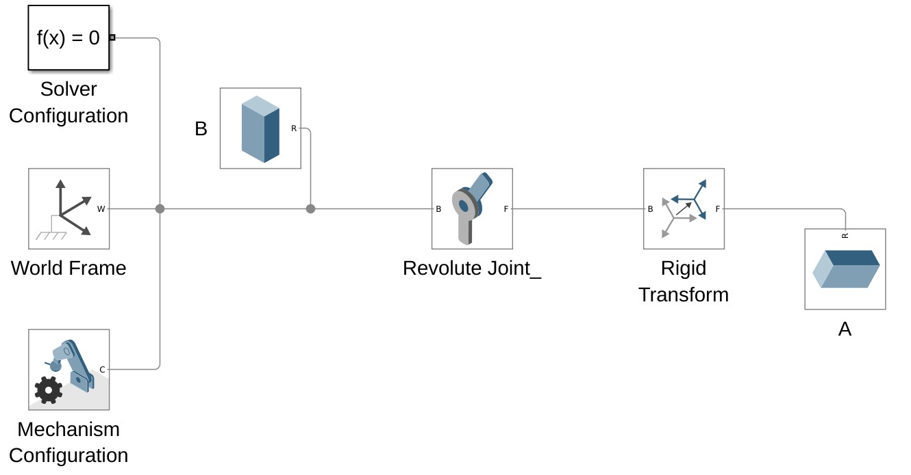 
  Figura 1. Diagrama de bloques en multibody de un pendulo.

  
  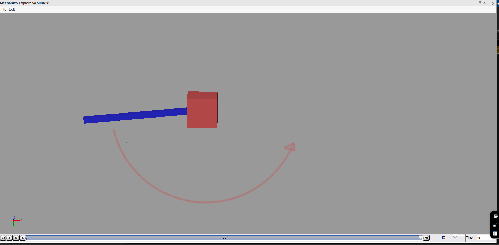 
  Figura 2. simulacion del pendulo en multibody.

## Pasos para Modelar el Sistema de Péndulo Invertido

1. **Definir el Marco Mundial:**
   - Colocar el bloque *World Frame* para establecer el sistema de coordenadas global, asegurando que todos los objetos en el modelo estén alineados con el sistema de referencia global.

2. **Configurar el Mecanismo:**
   - Añadir el bloque *Mechanism Configuration* para definir las propiedades del modelo mecánico.
   - Establecer la gravedad como *[0, -9.80665, 0]* para simular la aceleración debida a la gravedad en dirección negativa al eje Y.

3. **Crear la Base del Péndulo:**
   - Utilizar un bloque *Brick Solid* para representar la base (Bloque "B").
   - Definir sus dimensiones, por ejemplo, *[5 5 5]* y propiedades de masa, asegurándose de que el material tenga una masa representativa.
     
      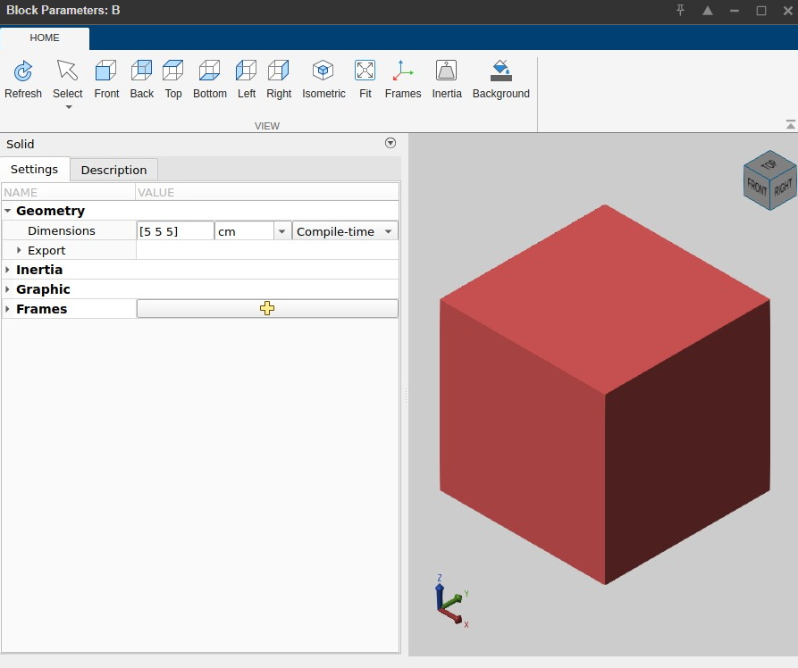
           Figura 3. Bloque "B".

4. **Crear el Brazo del Péndulo:**
   - Utilizar un bloque *Brick Solid* para representar el brazo del péndulo (Bloque "A").
   - Establecer las dimensiones del brazo, por ejemplo, *[20 1 1]*, y asignar las propiedades de masa correspondientes.

      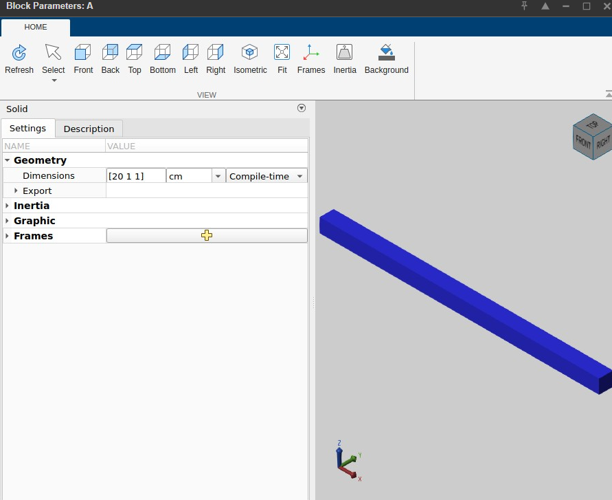
         Figura 4. Bloque "A".

5. **Posicionar el Brazo:**
   - Colocar el brazo en la posición correcta usando un bloque *Rigid Transform*.
   - Definir las coordenadas y la orientación del brazo en relación con el marco mundial.

     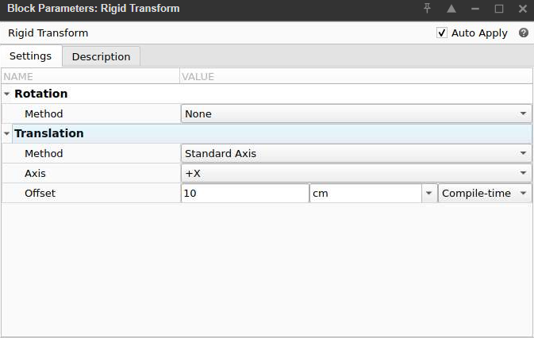   
       Figura 5. Rigid Transform.

6. **Añadir la Articulación:**
   - Conectar el brazo al marco mundial mediante un bloque *Revolute Joint*, lo que permite que el brazo gire alrededor de un eje fijo.
   - Asegurarse de que el eje de rotación del *Revolute Joint* esté alineado con el eje de rotación deseado.

7. **Definir las Restricciones de Movimiento:**
   - Ajustar las propiedades del *Revolute Joint* para definir los límites de movimiento, como los ángulos máximo y mínimo de rotación para evitar movimientos no deseados.

8. **Añadir un Motor o Fuerza (Opcional):**
   - Si se desea simular el control o la activación del péndulo, agregar un bloque *Torque* o un *Electric Motor* para proporcionar la fuerza necesaria para controlar el movimiento del brazo.

9. **Simular el Sistema:**
   - Ejecutar la simulación para observar el comportamiento del sistema de péndulo.
   - Ajustar parámetros como la masa, dimensiones y gravedad según sea necesario para obtener el comportamiento deseado.

     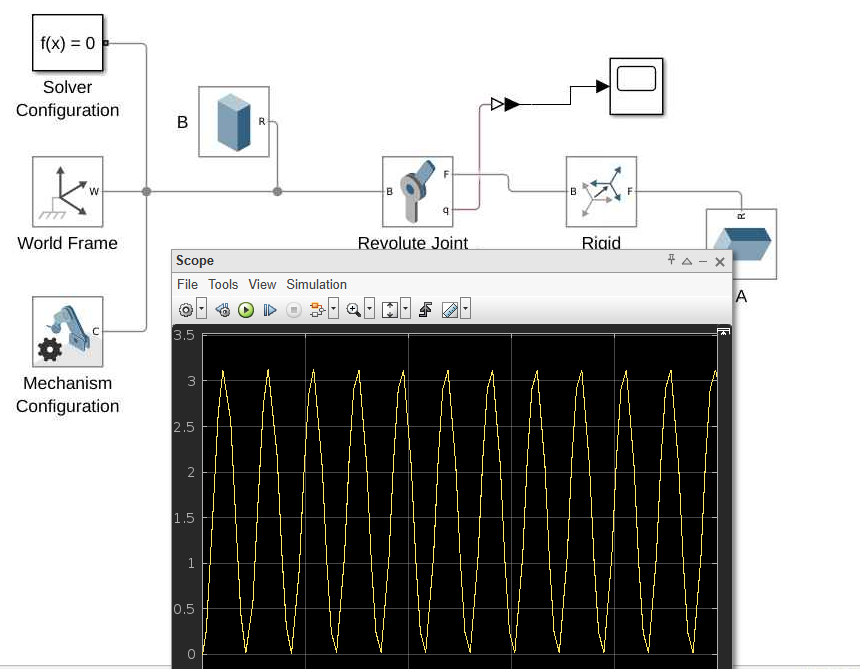   
       Figura 6. Grafica de posición.

---

# Ejemplo #2.
# Movimiento de Puerta Giratoria en Simscape Multibody

## Nombre del Movimiento

El movimiento mostrado en la simulación es un **"movimiento de compuerta o viga oscilante"**, similar a una **estructura en pórtico** donde la viga horizontal (roja) oscila o gira respecto a los dos pilares verticales.

# Instructivo: Cómo Crear el Movimiento en MATLAB Simscape Multibody

##  Elementos Necesarios

- `World Frame`
- `Mechanism Configuration`
- `Solver Configuration`
- `Rigid Transform`
- `Revolute Joint`
- `Solid`
- `Simulink-PS Converter`
- `Signal Builder` o `Step` o `Ramp` (fuente de señal)

##  Insertar el Marco Mundial

- Agregar bloque `World Frame`.
- Define el sistema de coordenadas global del modelo.

## Configurar el Mecanismo

- Agregar bloque `Mechanism Configuration`.
- Establecer la gravedad como: [0 -9.80665 0]

## Entrada del Movimiento

- Añadir un bloque `Signal Builder`, `Step` o una señal `Sine Wave`.
- Convertir señal con el bloque `Simulink-PS Converter`.
- Esto generará un torque en una junta.

## Crear Sólidos (`Brick Solid`)

### Brazo vertical (gris)
- Dimensiones: `[0.1 0.4 0.1]` 

### Brazo horizontal (rojo)
- Dimensiones: `[0.6 0.1 0.1]`

     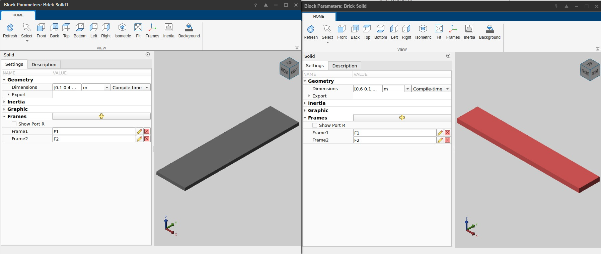   
       Figura 7. Brazos (Brick solid).

### Agregar Frames
- En cada bloque `Brick Solid`:
  - Activar `Frame1` y `Frame2`
  - Estos se usarán para conectar con las juntas rotacionales.

## Conectar con Juntas Rotacionales

- Agregar tres bloques `Revolute Joint`:
  - Junta 1: `World Frame` ↔ `Brazo vertical izquierdo`
  - Junta 2: `Brazo vertical izquierdo` ↔ `Brazo horizontal`
  - Junta 3: `Brazo horizontal` ↔ `Brazo vertical derecho`

- En cada junta:
  - Conectar `port B` y `port F` correctamente con los `Frames` de los sólidos.

    
     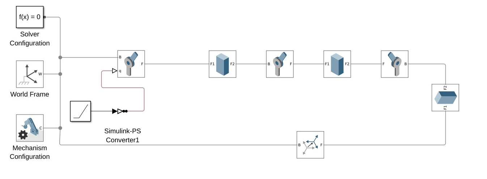   
       Figura 8. Diagrama de bloques.

## Configurar el Movimiento Actuado

En la `Junta 1` (conectada al mundo):

- Pestaña `Actuation`:
  - `Torque`: `Provided by Input`
  - `Motion`: `Automatically Computed`

- Conectar el `Simulink-PS Converter` al `puerto del torque`.

## Ejecutar y Visualizar

- Ejecutar la simulación.
- Se abrirá el `Mechanics Explorer` con la animación del sistema.
- El movimiento será oscilatorio, tipo vaivén, dependiendo del perfil de señal aplicado.

     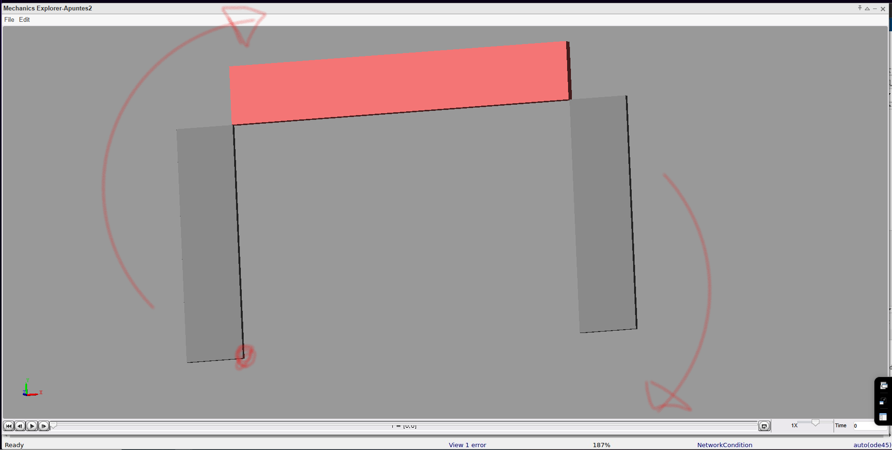   
       Figura 9. simulación de movimiento.

---

# Ejemplo #3.
# Movimiento de Biela manivela

biela_manivela_simscape:
  titulo: Simulación de mecanismo biela-manivela en Simscape Multibody
  descripcion: >
    Este instructivo describe cómo construir y simular un sistema biela-manivela en MATLAB Simscape Multibody.
    El sistema convierte un movimiento rotacional en un movimiento lineal usando una manivela, una biela y un émbolo.

  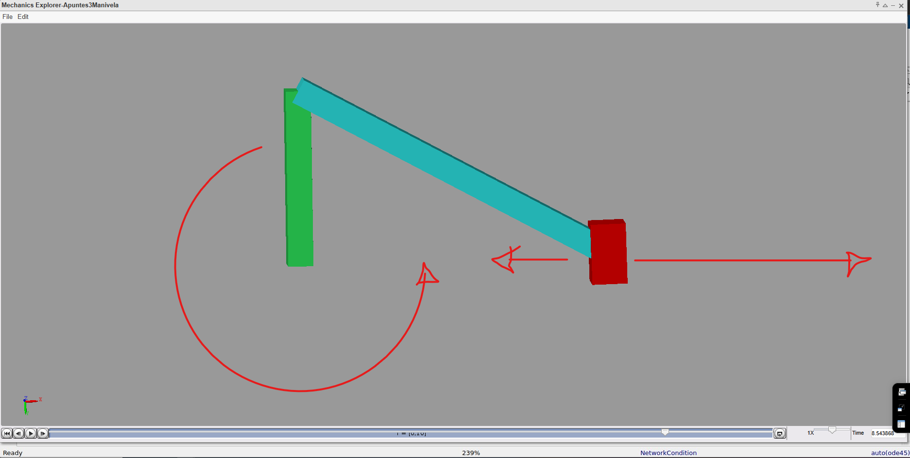   
   Figura 10. simulación de movimiento.
   
  pasos:
    - paso: Crear un nuevo modelo
      instrucciones:
        - Abrir MATLAB y crear un nuevo modelo de Simulink.
        - Arrastrar el bloque "Simscape > Multibody > World Frame" al espacio de trabajo.
    
 - paso: Agregar la manivela
      instrucciones:
        - Insertar un bloque "Solid" y configurar sus dimensiones para representar la manivela.
        - Añadir un "Revolute Joint" y conectarlo entre el World Frame y la manivela.
        - Establecer un torque con un bloque "Joint Actuator" o una señal senoidal.

 - paso: Agregar la biela
      instrucciones:
        - Insertar otro bloque "Solid" para representar la biela.
        - Conectar un nuevo "Revolute Joint" entre la manivela y la biela.
        - Ajustar la posición inicial con un "Rigid Transform" si es necesario.

 - paso: Agregar el émbolo
      instrucciones:
        - Insertar un bloque "Solid" para el émbolo o pistón.
        - Conectar la biela al émbolo mediante un "Revolute Joint".
        - Agregar un "Prismatic Joint" entre el émbolo y el World Frame, restringido al eje X.

 - paso: Establecer condiciones iniciales y señales
      instrucciones:
        - Aplicar una entrada de velocidad angular constante o sinusoidal a la manivela.
        - Verificar que todos los ejes de rotación estén alineados correctamente.
        - Usar "Scopes" o "Simscape Results Explorer" para visualizar el movimiento del émbolo.

    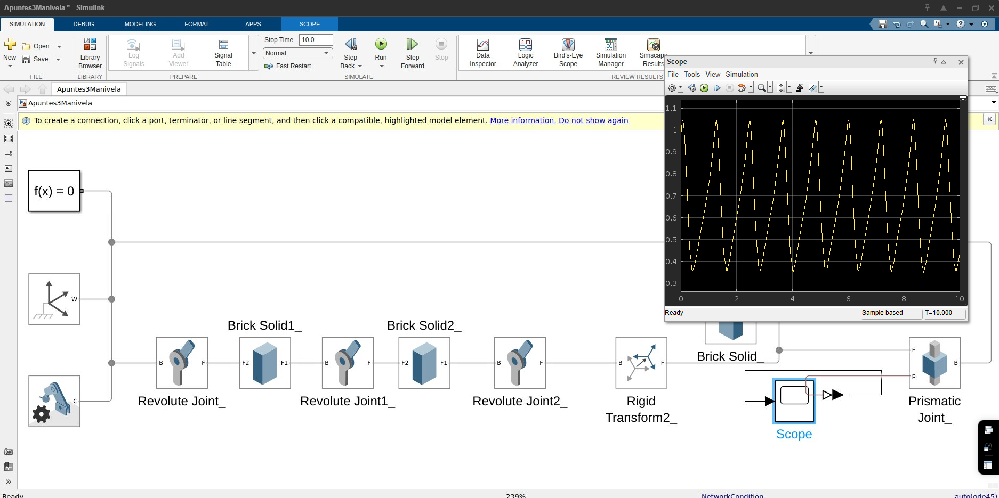   
    Figura 11. Diagrama de bloques con grafica de posicion de vector final.

   - paso: Ejecutar simulación
      instrucciones:
        - Configurar el tiempo de simulación (ej. 10 segundos).
        - Ejecutar el modelo.
        - Observar el movimiento oscilatorio generado en el émbolo.

---

# Diseño de Transmisión - Control de Movimiento
   

conclusiones:
   Se comprendió el principio de conversión de movimiento rotacional en movimiento lineal mediante el mecanismo biela-manivela, observando cómo la rotación continua de una manivela genera un movimiento alternativo en el émbolo. 
   La implementación en Simscape Multibody permite visualizar claramente la cinemática del sistema, identificando cómo interactúan las juntas rotacionales y prismáticas para permitir el movimiento deseado.
   Se reforzó el uso adecuado de bloques fundamentales como "Solid", "Revolute Joint", "Prismatic Joint" y "Rigid Transform", así como la importancia de alinear correctamente los ejes de movimiento entre cada componente.
   El uso de sensores y bloques de visualización como "Scope" o "Mechanics Explorer" permitió analizar gráficamente el comportamiento dinámico del sistema, facilitando su validación.
   Este ejercicio sirvió como base para modelar sistemas mecánicos más complejos, permitiendo aplicar principios de diseño mecánico, simulación y análisis en un entorno virtual antes de su implementación física.
