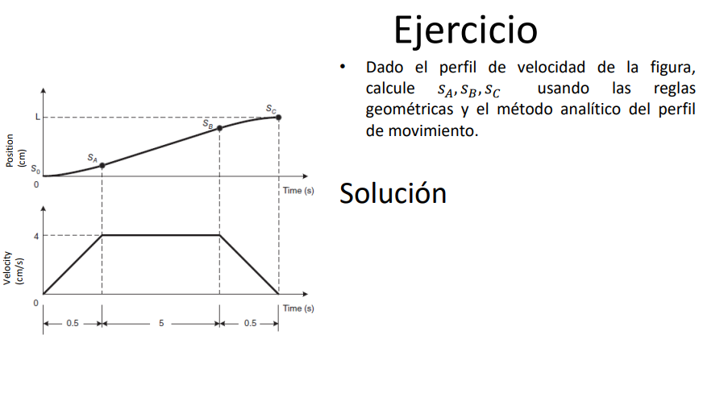

## 1. Control de Movimiento

- **Definición:**  
  Un *perfil de movimiento* es la trayectoria que debe seguir un punto desde la posición "A" hasta la posición "B".  
  - En el caso más simple (movimiento en un solo eje), la trayectoria es una línea recta.  
  - En movimientos más complejos se requieren múltiples ejes y la combinación de distintos perfiles para lograr una tarea específica.

- **Componentes del Perfil:**  
  El perfil incluye la evolución de la **posición**, **velocidad** y **aceleración** en cada etapa del movimiento.

---

## 2. Cinemática: Conceptos Básicos

### 2.1 Variables Fundamentales

- **Posición:** Se representa como $$s(t)$$ (función del tiempo).
  
- **Velocidad:** Se define como el cambio de la posición respecto al tiempo: $$v(t)=\frac{ds(t)}{dt}$$.
  
- **Aceleración:** Se define como el cambio de la velocidad en el tiempo: $$a(t)=\frac{dv(t)}{dt}$$.

### 2.2 Representación Integral

Las relaciones se pueden expresar de forma integral:
- **Posición como integral de la velocidad:** $$s(t)=\int v(t)\,dt$$.
  
- **Velocidad como integral de la aceleración:** $$v(t)=\int a(t)\,dt$$.

### 2.3 Reglas Geométricas

- La **posición** en un instante es igual al área bajo la curva de la velocidad hasta ese instante.
- La **aceleración** es la pendiente de la curva de velocidad.

### 2.4 Fórmulas para Movimiento con Aceleración Constante

Considerando: $$t_0=\text{tiempo inicial}$$, $$s_0=\text{posición inicial}$$, $$v_0=\text{velocidad inicial}$$, $$a=\text{aceleración constante}$$, se tiene:

- **Velocidad:** $$v(t)=v_0+a\,(t-t_0)$$.
  
- **Posición:** $$s(t)=s_0+v_0\,(t-t_0)+\frac{1}{2}\,a\,(t-t_0)^2$$.

---

## 3. Ejemplos y Ejercicios

### 3.1 Ejemplo: Cálculo de Posición y Aceleración a un Tiempo Dado

**Enunciado:**  

Se tiene un eje que viaja a una velocidad de $$10\,\text{cm/s}$$. En $$t=5\,\text{s}$$ inicia la desaceleración hasta detenerse (aceleración negativa). Se indica que la desaceleración se muestra en el perfil a partir de 25 cm.

**Solución:**

1. **Cálculo de la aceleración:**  
   - Velocidad inicial: $$10\,\text{cm/s}$$.
     
   - Conversión: $$10\,\text{cm/s}=0.1\,\text{m/s}$$.
     
   - Tiempo cuando se detiene: $$t=15\,\text{s}$$.
      
   La aceleración es: $$a=\frac{\Delta v}{\Delta t}=\frac{-0.1\,\text{m/s}}{15\,\text{s}-5\,\text{s}}=\frac{-0.1\,\text{m/s}}{10\,\text{s}}=-0.01\,\text{m/s}^2$$.

2. **Cálculo de la posición:**
   
   Se obtiene el área bajo la curva de velocidad (forma triangular) durante la desaceleración:
    
   $$s=\frac{1}{2}\times(\text{tiempo de desaceleración})\times(\text{velocidad máxima})$$, donde
   
   $$\text{tiempo de desaceleración}=15\,\text{s}-5\,\text{s}=10\,\text{s}$$ y
   
   $$\text{velocidad máxima}=0.1\,\text{m/s}$$.
    
   Entonces, $$s=\frac{1}{2}\times10\,\text{s}\times0.1\,\text{m/s}=0.5\,\text{m}$$.

---

### 3.2 Ejercicio: Movimiento de un Eje Lineal

**Enunciado:**  

Un eje lineal comienza su movimiento desde el reposo en la posición 0, con una aceleración de $$2\,\text{m/s}^2$$. Después de moverse durante $$5\,\text{s}$$, ¿cuál es la posición alcanzada?

**Solución:**  

Utilizando la fórmula para posición con aceleración constante:  

$$s(t)=s_0+v_0\,t+\frac{1}{2}\,a\,t^2$$,  

donde  

$$s_0=0,\quad v_0=0,\quad a=2\,\text{m/s}^2,\quad t=5\,\text{s}$$.  

Sustituyendo, obtenemos:  

$$s(5)=0+0\cdot5+\frac{1}{2}\times2\,\text{m/s}^2\times(5\,\text{s})^2=1\times25=25\,\text{m}$$.  

Por lo tanto, la posición del eje después de $$5\,\text{s}$$ es **25 m**.

---

## 4. Perfiles de Movimiento Comunes

Existen diversos perfiles de movimiento para controlar la aceleración y desaceleración en aplicaciones reales. Los más comunes son:
- **Perfil Trapezoidal:**
  
  Compuesto por tres fases:
  1. **Fase de aceleración:** Incremento de la velocidad hasta alcanzar la velocidad máxima $$v_m$$.
  2. **Fase de velocidad constante:** Movimiento a $$v_m$$ durante un intervalo de tiempo.
  3. **Fase de desaceleración:** Reducción de la velocidad hasta detenerse.
     
- **Perfil en S (Sigmoidal o Gaussiano):**  
  Permite transiciones más suaves, evitando cambios bruscos en la aceleración.

#El Concepto de Jerk

En un movimiento ideal, se suele asumir que la aceleración cambia de forma instantánea entre sus valores máximos y cero; sin embargo, en la práctica, estas variaciones deben ser suavizadas para evitar impactos y tensiones excesivas sobre los sistemas mecánicos. Aquí es donde entra en juego el **jerk**, que se define como la derivada de la aceleración con respecto al tiempo:

$$\text{Jerk} = \frac{da(t)}{dt}$$

El jerk es fundamental porque:

- **Reduce Vibraciones:** Una transición brusca en la aceleración (un jerk alto) puede generar vibraciones y resonancias en la estructura del sistema.
- **Protege Componentes Mecánicos:** Un jerk controlado reduce el estrés mecánico sobre motores, ejes y conexiones, incrementando su vida útil.
- **Mejora la Confortabilidad:** En aplicaciones donde interactúa directamente con personas (como en vehículos o en aplicaciones de robótica), un jerk bajo mejora la experiencia del usuario al minimizar la sensación de "sacudida" o sobresalto.

## Ejemplos Aplicados

### -Fuerza en Motores y Sistemas de Control

En sistemas de automatización o CNC (control numérico computarizado), el perfil trapezoidal es utilizado para planificar la trayectoria de motores. Cuando la aceleración varía bruscamente, el jerk elevado puede inducir:

- **Sobrecarga mecánica:** Los motores y sus mecanismos pueden sufrir daños si se exceden los límites de aceleración y cambios repentinos.
- **Desempeño no óptimo:** En algunos sistemas, un jerk alto puede causar oscilaciones o sobreimpulsos en los controladores de motor, generando errores en el posicionamiento.

Para evitar estos problemas, se implementan estrategias para limitar el jerk, incluso cuando el perfil de velocidad es trapezoidal. Esto a veces conduce a perfiles “en S”, donde se suavizan los extremos del trayecto, creando transiciones más graduales en la aceleración.

### -Fórmula 1: Fuerzas y la Cabeza del Conductor

En los autos de Fórmula 1, el control del movimiento es crítico tanto para el rendimiento como para la seguridad:
  
- **Aceleraciones Extremas:** Los pilotos experimentan fuertes aceleraciones y desaceleraciones durante la competición. Un cambio brusco en la aceleración (jerk alto) se traduce en fuerzas verticales y laterales que afectan al cuerpo y, en particular, pueden generar esfuerzos excesivos sobre la cabeza.
- **Protección del Conductor:** Las políticas de diseño y los sistemas de asistencia deben minimizar el jerk para reducir la carga en el arnés de seguridad y en el casco del piloto. Esto es importante para evitar lesiones y para mantener la concentración durante maniobras de alta demanda.
- **Diseño del Chasis y Suspensión:** En el desarrollo del auto, los ingenieros optimizan los componentes del chasis y la suspensión para absorber estas variaciones en aceleración, controlando el jerk y, por ende, reduciendo el desgaste mecánico y mejorando la estabilidad en curvas y frenadas.

### 4.1 Perfil Trapezoidal: Desarrollo Analítico

- **Fase de Aceleración ($$0<t<t_a$$):** La posición se obtiene integrando la aceleración:  
  $$s(t)=\int_0^{t_a}a\,t\,dt=\frac{1}{2}\,a\,t_a^2$$.
  
- **Fase de Velocidad Constante ($$t_a<t<t_a+t_m$$):** La posición es:  
  $$s(t)=s(t_a)+v_m\,(t-t_a)$$.
  
- **Fase de Desaceleración ($$t_a+t_m<t<t_{\text{total}}$$):** La posición se determina con:  
  $$s(t)=s(t_a+t_m)+v_m\,(t-(t_a+t_m))-\frac{1}{2}\,a\,(t-(t_a+t_m))^2$$,  
  donde $$s(t_a+t_m)$$ es la posición al final de la fase de velocidad constante.

### 4.2 Ejemplo de Perfil Trapezoidal

**Enunciado:**  
El eje $$x$$ de un robot Gantry debe moverse $$10\,\text{cm}$$. La aceleración máxima permitida es $$1\,\text{cm/s}^2$$ y la velocidad máxima es $$2\,\text{cm/s}$$. ¿Cuánto tiempo tomará el movimiento?

**Desarrollo:**
1. **Tiempo de aceleración y desaceleración ($$t_a$$ y $$t_d$$):**  
   Con $$a=1\,\text{cm/s}^2$$:  
   $$t_a=t_d=\frac{v_m}{a}=\frac{2\,\text{cm/s}}{1\,\text{cm/s}^2}=2\,\text{s}$$.
   
3. **Tiempo de velocidad constante ($$t_m$$):**  
   Con recorrido total $$L=10\,\text{cm}$$:  
   $$t_m=\frac{L}{v_m}-t_a=\frac{10\,\text{cm}}{2\,\text{cm/s}}-2\,\text{s}=5\,\text{s}-2\,\text{s}=3\,\text{s}$$.
   
4. **Tiempo total del movimiento:**  
   Sumando las tres fases:  
   $$t_{\text{total}}=t_a+t_m+t_d=2\,\text{s}+3\,\text{s}+2\,\text{s}=7\,\text{s}$$.

---

## 5. Ejercicio Adicional

   
  Figura 1.  Ejercicio Adicional.

**Enunciado:**  
Dado un perfil de velocidad (según la figura de referencia en los apuntes), calcular las posiciones $$s_A$$, $$s_B$$ y $$s_C$$ utilizando:
- **Reglas geométricas:** Se determina el área bajo la curva de velocidad.
- **Método analítico:** Se usan las fórmulas integrales definidas para cada fase del movimiento.

*Nota:* El desarrollo detallado dependerá de los valores específicos y de la forma geométrica del perfil de velocidad.

---
**Ejercicio**  
Dado el perfil de velocidad de la figura, calcule $$s_A, s_B, s_C$$ usando las reglas geométricas y el método analítico del perfil de movimiento.

---

**Solución**  

1. **Cálculo de $$s_A$$**  
 
   Luego del ajuste de escala (según se observa en la figura y en la conversión),
$$S_A = \frac{0.5 \cdot 4}{2} = 1 \, \text{cm}$$

$$S_A = \int_{0}^{0.5} \frac{4}{2} \, t dt$$

$$S_A = \int_{0}^{0.5} {8} \, t dt =  \frac{8t2^{2}}{2}$$

$$S_A =frac{8*0.5^{2}}{2}=1cm$$

2. **Cálculo de $$s_B$$**  
   A partir del área bajo la curva en el siguiente intervalo (entre 0.5 y 1.5 en el eje de tiempo y con la velocidad correspondiente), se acumula un desplazamiento adicional. Se detalla que la suma de aportes da:  
     $$S_B = 1 \, \text{cm} + (5 * 4) = 21 \, \text{cm}$$
   
     $$S_B=1 + \int_{0.5}^{5.5} {4} \,dt =  1 + 4t$$
   
     $$S_B = 1+\left ( 4\left ( 5.5 \right )-4\left ( 0.5 \right ) \right )=20cm+1cm$$

     $$S_B = 21 cm$$

3. **Cálculo de $$s_C$$**  
   Finalmente, el último tramo del perfil (último trapecio o área triangular de la velocidad) contribuye 1 cm más de desplazamiento:
   
   $$S_C = 21 \, \text{cm} + \frac{(0.5 \cdot 4)}{2} = 21 \, \text{cm} + 1 \, \text{cm}$$
   
   $$S_C = 22 \, \text{cm}$$

**Por lo tanto, los resultados finales son:**  
- $$s_A=1\,\text{cm}$$  
- $$s_B=21\,\text{cm}$$  
- $$s_C=22\,\text{cm}$$

## Conclusiones

- **Perfiles de Movimiento:** Se definen mediante la evolución de la posición, velocidad y aceleración a lo largo del tiempo.
- **Cinemática:** Relaciona estas magnitudes mediante derivadas e integrales. La posición es el área bajo la curva de la velocidad y la aceleración es la pendiente de dicha curva.
- **Perfil Trapezoidal:** Compuesto por fases de aceleración, velocidad constante y desaceleración; se puede resolver mediante métodos analíticos (integrales) y geométricos (áreas bajo la curva).
- **Ejemplos Prácticos:** Los ejemplos muestran la aplicación de las fórmulas en casos de movimiento con aceleración constante y en perfiles trapezoidales, utilizando tanto métodos integrales como geométricos.

