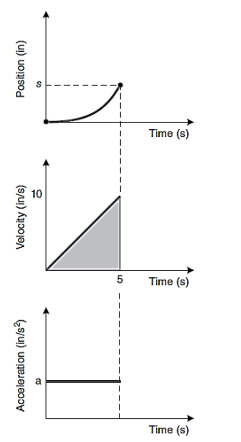

## 1. Control de Movimiento

- **Definición:**  
  Un *perfil de movimiento* es la trayectoria que debe seguir un punto desde la posición "A" hasta la posición "B".  
  - En el caso más simple (movimiento en un solo eje), la trayectoria es una línea recta.  
  - En movimientos más complejos se requieren múltiples ejes y la combinación de distintos perfiles para lograr una tarea específica.
  - son fundamentales para optimizar trayectorias en sistemas de control, yendo más allá del simple desplazamiento entre puntos. Su diseño involucra relaciones matemáticas entre **posición, velocidad y aceleración**, junto con estrategias geométricas para **minimizar distancias** y **consumo energético**.

- **Componentes del Perfil:**  
  El perfil incluye la evolución de la **posición**, **velocidad** y **aceleración** en cada etapa del movimiento.

---

## 2. Cinemática: Conceptos Básicos

### 2.1 Variables Fundamentales

- **Posición:** Se representa como $$s(t)$$ (función del tiempo).
  
- **Velocidad:** Se define como el cambio de la posición respecto al tiempo: $$v(t)=\frac{ds(t)}{dt}$$.
  
- **Aceleración:** Se define como el cambio de la velocidad en el tiempo: $$a(t)=\frac{dv(t)}{dt}$$.

# Análisis de la Imagen: Curvas de Movimiento

  
  
Figura 2.  Grafico curvas.

La imagen muestra la representación gráfica de las **relaciones fundamentales entre posición, velocidad y aceleración** en un sistema de movimiento unidimensional.

## Gráfico de Posición $$s(t)$$ vs Tiempo $$t$$

- En la parte superior se muestra la curva de posición en función del tiempo.
- Se observa cómo la posición aumenta de manera no lineal desde el punto A hasta el punto B, lo cual sugiere un movimiento acelerado.
- **Importante:** La posición se obtiene como la integral de la velocidad:

  $$s = \int v(t)\,dt$$

## Gráfico de Velocidad $$v(t)$$ vs Tiempo $$t$$

- La segunda gráfica representa la velocidad a lo largo del tiempo.
- La línea recta indica que la **velocidad está aumentando linealmente**, lo cual implica una **aceleración constante**.
- El área bajo la curva de velocidad (en este caso, un triángulo sombreado) representa el **desplazamiento total** del cuerpo durante el tiempo analizado.
- En la imagen se anota:  
  > "Area of this triangle is the final position"  
  Esto hace referencia a que el desplazamiento final es igual al área bajo la curva de velocidad.

## Gráfico de Aceleración $$a(t)$$ vs Tiempo $$t$$

- La tercera gráfica ilustra cómo varía la aceleración con respecto al tiempo.
- Se muestra una **línea constante**, lo que confirma que la aceleración es constante en este caso.
- Se anota que la **pendiente de la gráfica de velocidad** corresponde al valor de la aceleración:

  $$a(t) = \frac{dv}{dt}$$

### 2.2 Representación Integral

Las relaciones se pueden expresar de forma integral:
- **Posición como integral de la velocidad:** $$s(t)=\int v(t)\,dt$$.
  
- **Velocidad como integral de la aceleración:** $$v(t)=\int a(t)\,dt$$.

### 2.3 Reglas Geométricas

La denominación "**geométrica**" surge de la representación gráfica de las curvas de movimiento. Este método **simplifica cálculos** usando propiedades de figuras geométricas para determinar parámetros clave del movimiento, como:

- Aceleraciones máximas
- Tiempos de transición
- Velocidad de operación

- La **posición** en un instante es igual al área bajo la curva de la velocidad hasta ese instante.
- La **aceleración** es la pendiente de la curva de velocidad.
- Los perfiles de movimiento actúan como **entrada de referencia para controladores**, que ajustan la trayectoria en tiempo real para mantener:

- Precisión
- Eficiencia
- Estabilidad del sistema

    
  
Figura 2.  Ejemplo Reglas geometricas.

### 2.4 Fórmulas para Movimiento con Aceleración Constante

Considerando: $$t_0=\text{tiempo inicial}$$, $$s_0=\text{posición inicial}$$, $$v_0=\text{velocidad inicial}$$, $$a=\text{aceleración constante}$$, se tiene:

- **Velocidad:** $$v(t)=v_0+a\,(t-t_0)$$.
  
- **Posición:** $$s(t)=s_0+v_0\,(t-t_0)+\frac{1}{2}\,a\,(t-t_0)^2$$.

---

## 3. Ejemplos y Ejercicios

### 3.1 Ejemplo: Cálculo de Posición y Aceleración a un Tiempo Dado

**Enunciado:**  

Se tiene un eje que viaja a una velocidad de $$10\,\text{cm/s}$$. En $$t=5\,\text{s}$$ inicia la desaceleración hasta detenerse (aceleración negativa). Se indica que la desaceleración se muestra en el perfil a partir de 25 cm.

**Solución:**

1. **Cálculo de la aceleración:**  
   - Velocidad inicial: $$10\,\text{cm/s}$$.
     
   - Conversión: $$10\,\text{cm/s}=0.1\,\text{m/s}$$.
     
   - Tiempo cuando se detiene: $$t=15\,\text{s}$$.
      
   La aceleración es: $$a=\frac{\Delta v}{\Delta t}=\frac{-0.1\,\text{m/s}}{15\,\text{s}-5\,\text{s}}=\frac{-0.1\,\text{m/s}}{10\,\text{s}}=-0.01\,\text{m/s}^2$$.

2. **Cálculo de la posición:**
   
   Se obtiene el área bajo la curva de velocidad (forma triangular) durante la desaceleración:
    
   $$s=\frac{1}{2}\times(\text{tiempo de desaceleración})\times(\text{velocidad máxima})$$, donde
   
   $$\text{tiempo de desaceleración}=15\,\text{s}-5\,\text{s}=10\,\text{s}$$ y
   
   $$\text{velocidad máxima}=0.1\,\text{m/s}$$.
    
   Entonces, $$s=\frac{1}{2}\times10\,\text{s}\times0.1\,\text{m/s}=0.5\,\text{m}$$.

---

### 3.2 Ejercicio: Movimiento de un Eje Lineal

**Enunciado:**  

Un eje lineal comienza su movimiento desde el reposo en la posición 0, con una aceleración de $$2\,\text{m/s}^2$$. Después de moverse durante $$5\,\text{s}$$, ¿cuál es la posición alcanzada?

**Solución:**  

Utilizando la fórmula para posición con aceleración constante:  

$$s(t)=s_0+v_0\,t+\frac{1}{2}\,a\,t^2$$,  

donde  

$$s_0=0,\quad v_0=0,\quad a=2\,\text{m/s}^2,\quad t=5\,\text{s}$$.  

Sustituyendo, obtenemos:  

$$s(5)=0+0\cdot5+\frac{1}{2}\times2\,\text{m/s}^2\times(5\,\text{s})^2=1\times25=25\,\text{m}$$.  

Por lo tanto, la posición del eje después de $$5\,\text{s}$$ es **25 m**.

---

## 4. Perfiles de Movimiento Comunes

Existen diversos perfiles de movimiento para controlar la aceleración y desaceleración en aplicaciones reales. Los más comunes son:
- **Perfil Trapezoidal:**
  
  Compuesto por tres fases:
  1. **Fase de aceleración:** Incremento de la velocidad hasta alcanzar la velocidad máxima $$v_m$$.
  2. **Fase de velocidad constante:** Movimiento a $$v_m$$ durante un intervalo de tiempo.
  3. **Fase de desaceleración:** Reducción de la velocidad hasta detenerse.
     
- **Perfil en S (Sigmoidal o Gaussiano):**  
  Permite transiciones más suaves, evitando cambios bruscos en la aceleración.

#El Concepto de Jerk

En un movimiento ideal, se suele asumir que la aceleración cambia de forma instantánea entre sus valores máximos y cero; sin embargo, en la práctica, estas variaciones deben ser suavizadas para evitar impactos y tensiones excesivas sobre los sistemas mecánicos. Aquí es donde entra en juego el **jerk**, que se define como la derivada de la aceleración con respecto al tiempo:

$$\text{Jerk} = \frac{da(t)}{dt}$$

El jerk es fundamental porque:

- **Reduce Vibraciones:** Una transición brusca en la aceleración (un jerk alto) puede generar vibraciones y resonancias en la estructura del sistema.
- **Protege Componentes Mecánicos:** Un jerk controlado reduce el estrés mecánico sobre motores, ejes y conexiones, incrementando su vida útil.
- **Mejora la Confortabilidad:** En aplicaciones donde interactúa directamente con personas (como en vehículos o en aplicaciones de robótica), un jerk bajo mejora la experiencia del usuario al minimizar la sensación de "sacudida" o sobresalto.

## Ejemplos Aplicados

### -Fuerza en Motores y Sistemas de Control

En sistemas de automatización o CNC (control numérico computarizado), el perfil trapezoidal es utilizado para planificar la trayectoria de motores. Cuando la aceleración varía bruscamente, el jerk elevado puede inducir:

- **Sobrecarga mecánica:** Los motores y sus mecanismos pueden sufrir daños si se exceden los límites de aceleración y cambios repentinos.
- **Desempeño no óptimo:** En algunos sistemas, un jerk alto puede causar oscilaciones o sobreimpulsos en los controladores de motor, generando errores en el posicionamiento.

Para evitar estos problemas, se implementan estrategias para limitar el jerk, incluso cuando el perfil de velocidad es trapezoidal. Esto a veces conduce a perfiles “en S”, donde se suavizan los extremos del trayecto, creando transiciones más graduales en la aceleración.

### -Fórmula 1: Fuerzas y la Cabeza del Conductor

En los autos de Fórmula 1, el control del movimiento es crítico tanto para el rendimiento como para la seguridad:
  
- **Aceleraciones Extremas:** Los pilotos experimentan fuertes aceleraciones y desaceleraciones durante la competición. Un cambio brusco en la aceleración (jerk alto) se traduce en fuerzas verticales y laterales que afectan al cuerpo y, en particular, pueden generar esfuerzos excesivos sobre la cabeza.
- **Protección del Conductor:** Las políticas de diseño y los sistemas de asistencia deben minimizar el jerk para reducir la carga en el arnés de seguridad y en el casco del piloto. Esto es importante para evitar lesiones y para mantener la concentración durante maniobras de alta demanda.
- **Diseño del Chasis y Suspensión:** En el desarrollo del auto, los ingenieros optimizan los componentes del chasis y la suspensión para absorber estas variaciones en aceleración, controlando el jerk y, por ende, reduciendo el desgaste mecánico y mejorando la estabilidad en curvas y frenadas.

### 4.1 Perfil Trapezoidal: Desarrollo Analítico

- **Fase de Aceleración ($$0<t<t_a$$):** La posición se obtiene integrando la aceleración:  
  $$s(t)=\int_0^{t_a}a\,t\,dt=\frac{1}{2}\,a\,t_a^2$$.
  
- **Fase de Velocidad Constante ($$t_a<t<t_a+t_m$$):** La posición es:  
  $$s(t)=s(t_a)+v_m\,(t-t_a)$$.
  
- **Fase de Desaceleración ($$t_a+t_m<t<t_{\text{total}}$$):** La posición se determina con:  
  $$s(t)=s(t_a+t_m)+v_m\,(t-(t_a+t_m))-\frac{1}{2}\,a\,(t-(t_a+t_m))^2$$,  
  donde $$s(t_a+t_m)$$ es la posición al final de la fase de velocidad constante.

### 4.2 Ejemplo de Perfil Trapezoidal

**Enunciado:**  
El eje $$x$$ de un robot Gantry debe moverse $$10\,\text{cm}$$. La aceleración máxima permitida es $$1\,\text{cm/s}^2$$ y la velocidad máxima es $$2\,\text{cm/s}$$. ¿Cuánto tiempo tomará el movimiento?

**Desarrollo:**
1. **Tiempo de aceleración y desaceleración ($$t_a$$ y $$t_d$$):**  
   Con $$a=1\,\text{cm/s}^2$$:  
   $$t_a=t_d=\frac{v_m}{a}=\frac{2\,\text{cm/s}}{1\,\text{cm/s}^2}=2\,\text{s}$$.
   
3. **Tiempo de velocidad constante ($$t_m$$):**  
   Con recorrido total $$L=10\,\text{cm}$$:  
   $$t_m=\frac{L}{v_m}-t_a=\frac{10\,\text{cm}}{2\,\text{cm/s}}-2\,\text{s}=5\,\text{s}-2\,\text{s}=3\,\text{s}$$.
   
4. **Tiempo total del movimiento:**  
   Sumando las tres fases:  
   $$t_{\text{total}}=t_a+t_m+t_d=2\,\text{s}+3\,\text{s}+2\,\text{s}=7\,\text{s}$$.

---

## 5. Ejercicio Adicional

   
  Figura 3.  Ejercicio Adicional.

**Enunciado:**  
Dado un perfil de velocidad (según la figura de referencia en los apuntes), calcular las posiciones $$s_A$$, $$s_B$$ y $$s_C$$ utilizando:
- **Reglas geométricas:** Se determina el área bajo la curva de velocidad.
- **Método analítico:** Se usan las fórmulas integrales definidas para cada fase del movimiento.

*Nota:* El desarrollo detallado dependerá de los valores específicos y de la forma geométrica del perfil de velocidad.

---
**Ejercicio**  
Dado el perfil de velocidad de la figura, calcule $$s_A, s_B, s_C$$ usando las reglas geométricas y el método analítico del perfil de movimiento.

---

**Solución**  

1. **Cálculo de $$s_A$$**  
 
   Luego del ajuste de escala (según se observa en la figura y en la conversión),
$$S_A = \frac{0.5 \cdot 4}{2} = 1 \, \text{cm}$$

$$S_A = \int_{0}^{0.5} \frac{4}{2} \, t dt$$

$$S_A = \int_{0}^{0.5} {8} \, t dt =  \frac{8t2^{2}}{2}$$

$$S_A =frac{8*0.5^{2}}{2}=1cm$$

2. **Cálculo de $$s_B$$**  
   A partir del área bajo la curva en el siguiente intervalo (entre 0.5 y 1.5 en el eje de tiempo y con la velocidad correspondiente), se acumula un desplazamiento adicional. Se detalla que la suma de aportes da:  
     $$S_B = 1 \, \text{cm} + (5 * 4) = 21 \, \text{cm}$$
   
     $$S_B=1 + \int_{0.5}^{5.5} {4} \,dt =  1 + 4t$$
   
     $$S_B = 1+\left ( 4\left ( 5.5 \right )-4\left ( 0.5 \right ) \right )=20cm+1cm$$

     $$S_B = 21 cm$$

3. **Cálculo de $$s_C$$**  
   Finalmente, el último tramo del perfil (último trapecio o área triangular de la velocidad) contribuye 1 cm más de desplazamiento:
   
   $$S_C = 21 \, \text{cm} + \frac{(0.5 \cdot 4)}{2} = 21 \, \text{cm} + 1 \, \text{cm}$$
   
   $$S_C = 22 \, \text{cm}$$

**Por lo tanto, los resultados finales son:**  
- $$s_A=1\,\text{cm}$$  
- $$s_B=21\,\text{cm}$$  
- $$s_C=22\,\text{cm}$$

# Análisis de Fundamentos Matemáticos y Resolución de Ejercicios sobre Perfiles de Movimiento

Los perfiles de movimiento se diseñan para optimizar trayectorias en sistemas de control, aprovechando las relaciones matemáticas entre posición, velocidad y aceleración y aplicando estrategias geométricas para minimizar distancias y consumo energético. A continuación se presenta un análisis interpretativo que incluye fórmulas, ejemplos y la resolución de ejercicios.

---

## Fundamentos Matemáticos y Modelado

El diseño de perfiles se basa en los siguientes conceptos básicos:

La **posición** se determina integrando la velocidad:
$$s(t)=\int v(t)\,dt$$

La **velocidad** es la derivada de la posición:
$$v(t)=\frac{ds(t)}{dt}$$

La **aceleración** es la derivada de la velocidad:
$$a(t)=\frac{dv(t)}{dt}$$

Para modelar un segmento curvo del perfil de velocidad, se puede utilizar un polinomio de segundo orden, por ejemplo:
$$v(t)=C_1t^2+C_2t+C_3$$  
Dado que se parte del reposo (es decir, $$v(0)=0$$), se tiene $$C_3=0$$. Además, si se conoce que a mitad del período de aceleración (por ejemplo, en $$t=\frac{t_a}{2}$$) se alcanza la velocidad máxima $$v_m$$, se impone la condición
$$v\Big(\frac{t_a}{2}\Big)=C_1\left(\frac{t_a}{2}\right)^2+C_2\left(\frac{t_a}{2}\right)=v_m.$$

La **aceleración** se obtiene derivando la velocidad:
$$a(t)=2C_1t+C_2.$$
Evaluando en $$t=\frac{t_a}{2}$$ se obtiene la aceleración máxima:
$$a_{max}=C_1t_a+C_2.$$

En un perfil simétrico se puede simplificar asumiendo, por ejemplo, que
$$C_1=\frac{2v_m}{t_a^2} \quad \text{y} \quad C_2=0.$$
De esta forma, la velocidad y la aceleración quedan determinadas por:
$$v(t)=\frac{2v_m}{t_a^2}\,t^2,$$
$$a(t)=\frac{4v_m}{t_a^2}\,t.$$
Evaluando la aceleración en $$t=\frac{t_a}{2}$$:
$$a\Big(\frac{t_a}{2}\Big)=\frac{4v_m}{t_a^2}\cdot\frac{t_a}{2}=\frac{2v_m}{t_a}.$$

---

## Ejemplo: Obtención de la Posición a Partir del Perfil de Velocidad

Considerando la fase de aceleración modelada por:
$$v(t)=\frac{2v_m}{t_a^2}\,t^2,$$
la posición se obtiene integrando la velocidad:
$$s(t)=\int_0^t \frac{2v_m}{t_a^2}\,\tau^2\,d\tau
=\frac{2v_m}{t_a^2}\cdot\frac{t^3}{3}
=\frac{2v_m}{3t_a^2}\,t^3.$$

Si se quiere calcular la posición transcurridos 100 ms (0.1 s), se tiene:
$$s(0.1)=\frac{2v_m}{3t_a^2}\,(0.1)^3.$$

Por ejemplo, asumiendo que $$v_m=10\,\text{cm/s}$$ y $$t_a=0.4\,\text{s}$$:
$$s(0.1)=\frac{2(10)}{3(0.4)^2}(0.001)
=\frac{20}{3\cdot0.16}\cdot0.001
=\frac{20}{0.48}\cdot0.001
\approx41.67\cdot0.001=0.04167\,\text{cm}.$$
Este resultado expresa el desplazamiento acumulado durante la fase de aceleración en 100 ms, considerando la escala del movimiento.

---

## Ejemplo de Movimiento Multi-eje

El análisis de perfiles se extiende a sistemas multi-eje. Existen dos estrategias comunes:

### Movimiento Simultáneo (Slew Motion)

En este modo, cada eje opera con su propio perfil. Por ejemplo, para un eje X:
- Se tiene una distancia $$L_x=16\,\text{cm}$$ y velocidad $$v_x=4\,\text{cm/s}.$$
- El tiempo en la fase de velocidad constante se calcula como:
  $$t_{m_x}=\frac{L_x}{v_x}-t_a.$$
  Suponiendo $$t_a=0.2\,\text{s},$$ se obtiene:
  $$t_{m_x}=\frac{16}{4}-0.2=4-0.2=3.8\,\text{s}.$$
- El tiempo total para el eje X es:
  $$t_{total,x}=t_{m_x}+2t_a=3.8+0.4=4.2\,\text{s}.$$

Para un eje Y con $$L_y=12\,\text{cm}$$ y $$v_y=4\,\text{cm/s},$$ de forma similar se obtiene:
$$t_{m_y}=\frac{12}{4}-0.2=3-0.2=2.8\,\text{s},$$  
y el tiempo total:
$$t_{total,y}=2.8+0.4=3.2\,\text{s}.$$
En este caso, cada eje termina su movimiento en tiempos diferentes, lo cual es aceptable para *slew motion*.

### Movimiento Interpolado (Interpolated Motion)

Cuando es necesario que ambos ejes finalicen simultáneamente, se toma como referencia el eje que tarda más (por ejemplo, el eje X con $$t_{total,x}=4.2\,\text{s}$$) y se ajusta la velocidad del eje Y. La condición para que ambos terminen al mismo tiempo es:
$$t_{total,y}'=t_{m_y}'+2t_a=t_{total,x}.$$
El tiempo en la fase de velocidad constante del eje Y con velocidad modificada $$v_y'$$ se relaciona por:
$$t_{m_y}'=\frac{L_y}{v_y'}-t_a.$$
Igualando para cumplir la sincronización se obtiene:
$$\frac{L_y}{v_y'}=t_{total,x}-t_a,$$
y despejando:
$$v_y'=\frac{L_y}{t_{total,x}-t_a}.$$
Por ejemplo, con $$L_y=12\,\text{cm},\ t_{total,x}=4.2\,\text{s}$$ y $$t_a=0.2\,\text{s},$$ se tiene:
$$v_y'=\frac{12}{4.2-0.2}=\frac{12}{4}=3\,\text{cm/s}.$$
Esta modificación garantiza que ambos ejes concluyan su movimiento al mismo tiempo, algo crítico en sistemas que requieren coordinación exacta.

---

## Conclusiones

A lo largo del análisis realizado, se abordaron aspectos clave relacionados con el diseño y la planificación de trayectorias de movimiento en sistemas de control, utilizando principios de cinemática y perfiles de movimiento avanzados. Las siguientes conclusiones resumen los conceptos y métodos explicados:

Se demostró que los perfiles de velocidad, cuando son modelados mediante polinomios, pueden ajustarse adecuadamente a condiciones iniciales y de frontera, asegurando un movimiento controlado y eficiente. Este enfoque permite la evolución de la posición, velocidad y aceleración a lo largo del tiempo, garantizando trayectorias suaves y sin sobresaltos.

Se explicó cómo las magnitudes de posición, velocidad y aceleración están interrelacionadas a través de derivadas e integrales. La posición se obtiene como el área bajo la curva de velocidad, mientras que la aceleración corresponde a la pendiente de esta curva, lo que facilita la comprensión de los movimientos a lo largo del tiempo.

El perfil trapezoidal fue identificado como una opción eficiente que consta de fases de aceleración, velocidad constante y desaceleración. Se evidenció que este tipo de perfil puede resolverse tanto mediante métodos analíticos (como las integrales) como geométricos (áreas bajo la curva), lo que simplifica su implementación en sistemas reales.

Se destacó que los perfiles no lineales, especialmente aquellos ajustados para movimientos con aceleración constante y perfiles trapezoidales, ofrecen una mayor suavidad y eficiencia en comparación con los perfiles lineales. Este enfoque mejora el rendimiento global al reducir las vibraciones y aumentar la precisión de los movimientos.

La integración de estrategias de control adaptativo con modelos geométricos permite generar trayectorias más rápidas y precisas, optimizando el uso de los recursos energéticos. El balance entre la aceleración máxima y los tiempos de ciclo es clave para mejorar la eficiencia energética del sistema.

Se mencionó el uso de paralelización en GPU para la evaluación en tiempo real de múltiples trayectorias posibles, lo que agiliza la toma de decisiones y mejora la respuesta del sistema ante cambios dinámicos.

La elección del perfil de movimiento depende de varios factores críticos, como las inercias del sistema, los límites de torque y velocidad, los requisitos de precisión y el nivel de eficiencia energética necesario. Considerar estos factores asegura que la trayectoria seleccionada cumpla con los objetivos del sistema y optimice su rendimiento global.

